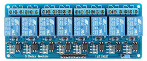
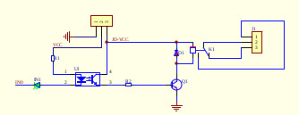
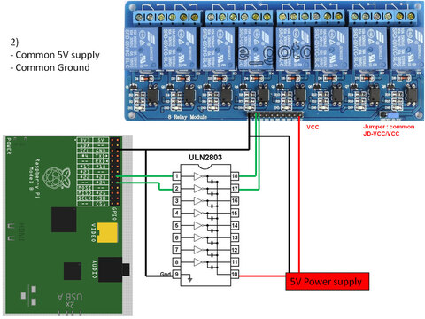
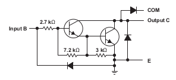

Switches/Relays
===============

I use 16 relays which are isolated by optocouplers. Although it might
be possible to drive those 16 LEDs directly from the built-in
Raspberry GPIOs, I wouldn't recommend that because there is a current
limit of 50mA on the 3.3V rail [#raspi_3v3_50mA]_. That is easily
exceeded in the worst case - where all 16 LEDs are on. One needs to
use a transistor of some form.

Another problem to solve is which of the Raspberry GPIOs to use to
drive the outputs. Much bigger of a problem though is the lack of
understanding of low-level electronic facts and consequences; see
further down below for a bookmark list.

.. contents:: Contents
   :local:

Sainsmart 8 Channel 5V Relay Board
----------------------------------

To switch water pumps and oil burners, big fat relays are
used. `Sainsmart has arrays of 8
<https://www.sainsmart.com/products/8-channel-5v-relay-module>`__
opto-isolated relays, cheap and easy to use.

   8 channel isolated relay board from Sainsmart

.. note::

   Driving the relays from the Rasperry's 5V rail is tempting, but
   you'll blow a fuse sooner or later (I had that) if you switch a
   couple of them at once. Give it a separate 5V supply!

   
   Schematic of one channel out of eight.

ULN2803A Darlington Transistor Array
------------------------------------

In my early days of making I used an array of 16 :download:`BC548C
<Sainsmart-Relayboard/bc548c-datasheet.pdf>` NPN transistors, together
with the obligatory resistors at the base. This made a huge breadboard
footprint (not to speak of soldering on the future PCB), so I decided
to go with a more integrated solution: `ULN2803A (PDF)
<http://www.ti.com/lit/gpn/ULN2803A>`__.

The chip consists of an array of eight `Darlington Transistors
<https://en.wikipedia.org/wiki/Darlington_transistor>`__, and provides
all I need (including clamp diodes that I don't need):

   Look, no resistors: all in one!

Simply connect the ULN2803A ``IN<n>`` pins directly to designated
Raspi GPIOs (see below), and the ULN2803A ``OUT<n>`` pins to the
Sainsmart ``IN<m>`` connectors.

Raspberry GPIO Usage
--------------------

Not being an electronic engineer, I was having a hard time to figure
out which of the Raspberry's GPIOs were usable and which were
not. Still hoping that I'll learn that craft someday [#arrogance]_;
that could be fun.

What's important is the *power-on reset (POR) state* - the
configuration that is applied to the pins right after power-on, before
software can configure anything.

First off, the POR *direction* of all pins is *input*. What's more
important is the *pullup/down POR state*. Some of the GPIOs are
configured as pullup at POR, and others are configured as
pulldown. See `BCM2835 ARM Peripherals
<http://www.raspberrypi.org/wp-content/uploads/2012/02/BCM2835-ARM-Peripherals.pdf>`__
, "6.2 Alternative Function Assignments" (100ff) for an extensive
listing describing which is configured as what (you may want to look
at the more approachable `elinux page
<https://elinux.org/RPi_BCM2835_GPIOs>`__).

It turns out that it's exactly the GPIOs whose POR pull state is
*pullup* are not stable - this is they are not consistently able to
lighten the optocoupler LED enough to switch the relay on the other
side. This makes some sense to a layman (/me); if you look at what's
inside the ULN2803A,

one can imagine that having a pullup of 50K (the Raspi internal value)
fight against the resistors does no good.

Sure, it would help if I could unconfigure the pullup. Sure, this
would be possible with `RPi.GPIO
<https://pypi.org/project/RPi.GPIO/>`__ - but that library is
Raspberry specific. Much like hardware engineers have a codex, a
software engineers (/me) has one too, so: *no!* [#gpiod]_.

Long Story Short: GPIO/Relay Mapping
....................................

Relays numbered 0 through 15, spanning both Sainsmart boards (with
ULN2803A sitting in between appropriately):

.. csv-table::
   :header: Raspi GPIO, Relay

   17, 0
   27, 1
   22, 2
   10, 3
   9, 4
   11, 5
   13, 6
   19, 7
   18, 8
   23, 9
   24, 10
   25, 11
   12, 12
   16, 13
   20, 14
   21, 15

Miscellaneous
-------------

Bookmarks: Electronics etc.
...........................

* `Demystifying Microcontroller GPIO Settings
  <https://embeddedartistry.com/blog/2018/06/04/demystifying-microcontroller-gpio-settings/>`__

Using MCP23017
..............

MCP23017 is a I2C/SPI IO expander. It can drive more current than pure
Raspi GPIOs can; I had a couple of them lying around so I gave it a
try. Easily attached (see for example
http://www.faschingbauer.co.at/de/howtos/gpio-mcp23017/, but dont
forget to connect RESET to 3V3 :-) )

Issues:

* (using ``gpiod``) closing the chip file-descriptor does not reset
  pins to their POR state. (This is likely the driver's fault.)
  *Unusable*: a crashing process might leave a pump running. Or, even
  worse, the oil burner.
* CPU reset does not propagate to MCP23017. *Unusable*: a hard reboot
  (one that does not terminate processes) would leave ... running.

.. rubric:: Footnotes

.. [#raspi_3v3_50mA] See `here
                     <https://elinux.org/RPi_Low-level_peripherals#General_Purpose_Input.2FOutput_.28GPIO.29>`__. The
                     information is a bit hard to come by; there's a
                     section "Power Pins" where it says, "The maximum
                     permitted current draw from the 3.3 V pins is 50
                     mA."
.. [#arrogance] Fortunately I know how to do software; doing a
                software project and not knowing what that is is much
                more severe.
.. [#gpiod] Openheating uses the `new GPIO userspace interface of the
	    kernel <https://lwn.net/Articles/565662/>`__, through an
	    accompanying userspace library, `libgpiod
	    <https://github.com/brgl/libgpiod>`__.
