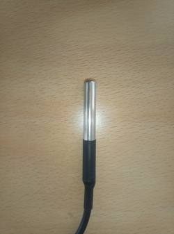
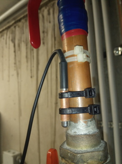
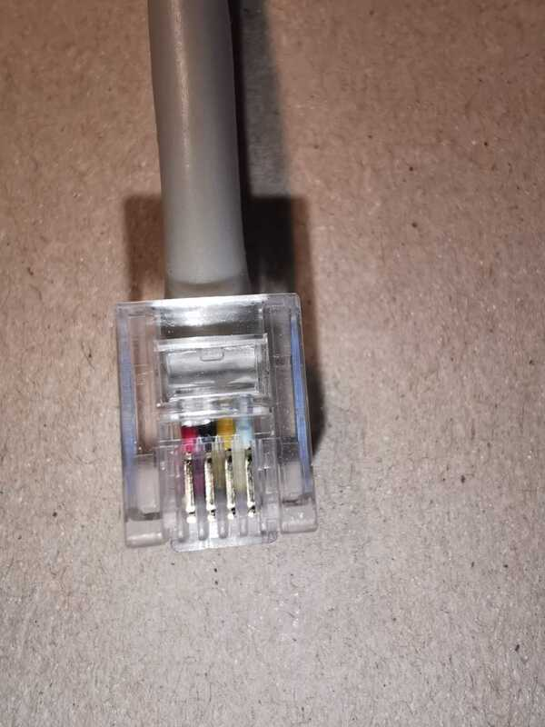
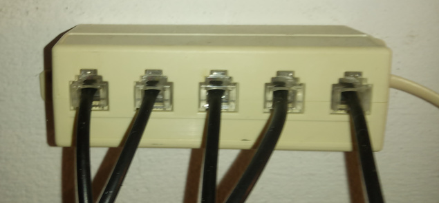
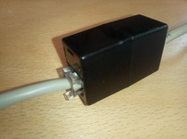
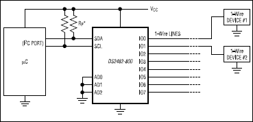

Thermometers
============

.. contents:: Contents
   :local:

Sensors: DS18B20
----------------

The `DS18B20 <https://www.maximintegrated.com/en/products/DS18B20>`__
Onewire temperature sensor is frequently used in comparable settings
[#everyone_does_it]_. You can finds parts that come prepackaged in a
metal case; these are still affordable, and really easy to deploy.



   DS18B20, nicely packaged in a metal case with cable



   DS18B20, mounted on *real* hardware

Cabling
-------

A `Onewire <https://en.wikipedia.org/wiki/1-Wire>`__ device has three
wires attached to: data, ground, and power. Data and ground are
mandatory, obviously. Power is optional; if omitted, the device is
said to be operated in *parasitic mode*.

That said, I use all three wires, mainly because rumours go that
communication is more stable then. (I cannot say, tried both, no
difference.) 

RJ11, Telephone Wires
.....................

"Telephone" cables have four wires (only three are used); you can buy
them everywhere. Telephones are connected with RJ11 plugs. I use this
setting in the following way.



   Facing copper contacts,

   .. csv-table::
      :header: Pin, Color, What

      1, Red, VCC
      2, Black, GND
      3, Yellow, Data
      4, White, (Unused)

With this at hand,

* sensors with plugs
* cables with plugs on either side

there's two more things you need to be happy,



   RJ11 hub



   RJ11 coupler

.. note::

   Please don't think that I am so picky and exact in everything I
   do. Only when I know I am really bad at something (like money) I
   tend to be exact.

Onewire Caveats
...............

For stability, a Onewire setup should not exhibit a star
topology. Rather, it is best to have a long line, with only short
branches where the sensors are attached.

I have multiple long lines from the "central" (in the basement next to
the oil burner) to the various branching points,

* Hot water boiler. A 1000l thing which has three thermometers:
  bottom, middle, top. These thermometers, and two more for the solar
  water circuit, branch off from the end of a ca. 15m line.
* Wood oven in the living room. A ca. 8m line, having another four
  thermometers.
* One long 15m line where one room thermometer sits in the middle adn
  one at the end.

Maxim Integrated has a tutorial, `Guidelines for Reliable Long Line
1-Wire Networks
<https://www.maximintegrated.com/en/app-notes/index.mvp/id/148>`__. There
they define the terms *radious* and *weight*; it is definitely worth
reading.

Onewire Master and Stability
----------------------------

``w1-gpio``: Bitbanging
.......................

Initially I was using the ``w1-gpio`` kernel module, where you
dedicate one GPIO to one Onewire line. Communication is done in
software - the kernel driver bitbangs the Onewire protocol onto the
line. I had dedicated three GPIOs, one each for the lines listed
above.

Configuration is easy; in ``/boot/config.txt`` you write,

.. code-block:: console

   dtoverlay=w1-gpio,gpiopin=7
   dtoverlay=w1-gpio,gpiopin=26
   dtoverlay=w1-gpio,gpiopin=27

, and connect the respective pins to the three bus lines.

During that time, there were still instabilities; I summarize them
here for reference (and because in my nightmares I see those coming
back).

* **Devices disappear**, and are replaced by ones that are named like
  ``00-0c4000000000``. Here, ``00`` is the family which is completely
  bogus; for example, 28 (hex) would be the expected familiy. (I
  believe 0x28 stands for "Dallas").

* **Reading fails a CRC check**,

  .. code-block:: shell

     $ cat /sys/bus/w1/devices/28-02131d9920aa/w1_slave 
     20 01 4b 46 7f ff 0c 10 5d : crc=5d NO
     20 01 4b 46 7f ff 0c 10 5d t=18000

* **Reading gives me a temperature of 0 degrees.**

  .. code-block:: shell

     $ cat /sys/bus/w1/devices/28-011432f138f9/w1_slave 
     00 00 00 00 00 00 00 00 00 : crc=00 YES
     00 00 00 00 00 00 00 00 00 t=0

  This is the worst thermometer error you can encounter because it
  does not declare himself as such. One can imagine what sorts of
  heating control misbehavior a room temperature of zero degrees would
  cause.

Over time, I was able to reduce the instabilities by cutting the
initial star topology down to what I describe above. Still, there were
some glitches from time to time. I blame those on the bitbanging in
software. Onewire is a slow and easy protocol, but there are still
timing constraints that might not be met in some cases.

Sure, I could have tried the Linux realtime options to get better
response and timing guarantees. On the other hand, heating control is
something that is exactly the opposite of realtime. If a pump is
turned on a minute too late, still nothing burns down - this is not a
nuclear power plant.

So no: no realtime wanted. Especially because it would have been just
another tryout.

DS2482-800+: Master on I2C
..........................

The `DS2482-800
<https://www.maximintegrated.com/en/products/interface/controllers-expanders/DS2482-800.html>`__
is an eight port Onewire master that is connected to the CPU via
I2C. Eight port means, you can have eight long Onewire lines with one
chip. Cool; should have done that earlier [#know_what_not_want]_.

Setup is easy; here's a little excerpt from the datasheet.



Pullups are sized 2.2K; you can find that mentioned somewhere in the
datasheet [#datasheet_fun]_.

To tell the Raspi and Linux about it,

Enable I2C on the Raspi
```````````````````````

In ``/boot/config.txt`` you write

.. code-block:: console

   dtparam=ic2=on
   i2c_arm=on

(In ``/boot/overlays/README`` both are documented, so I write both. I
can imagine that one can be omitted, but I don't care.)

Announce the I2C device to the OS
`````````````````````````````````

In the above diagram, pins ``AD0``, ``AD1``, and ``AD2`` are connected
to ground, which yields I2C address 0x18 for the device.

.. code-block:: console

   # echo ds2482 0x18 > /sys/bus/i2c/devices/i2c-1/new_device

This creates a new I2C device in ``sysfs``,
``/sys/bus/i2c/devices/i2c-1/1-0018/``, and loads the ``ds2482``
kernel module. Onewire devices are probed, and appear in
``/sys/bus/w1/devices/``, just like with ``w1-gpio``.

Here's a ``systemd`` unit that does just that,

.. literalinclude:: /installations/faschingbauer/i2c1-ds2482-0x18.service
  

**The effect? No sensor outages since I deployed the DS2482-800 (which
is roughly two months as of this writing).**


.. rubric:: Footnotes

.. [#everyone_does_it] Everyone does their own private heating
                       control. Mine is just the best.
.. [#know_what_not_want] On the other hand: what you should always
                         know for sure is *what you don't want* - the
                         time spent with bitbanging was not wasted.
.. [#datasheet_fun] Datasheet authors have a strange kind of humor.
