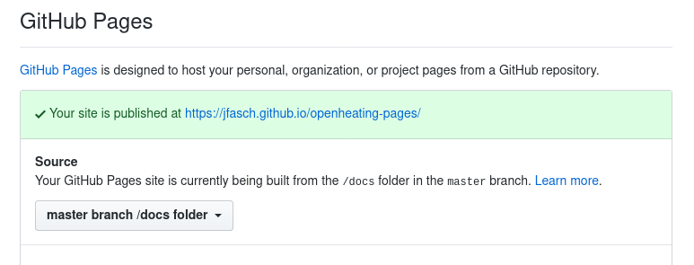

Deploying Sphinx Generated Documentation to Github Pages
========================================================

.. contents::

Create "Site Publication Repo"
------------------------------

.. important::

   No, we do *not* pollute our source repo :file:`jfasch/openheating`
   with binary content, as Github suggests. This reminds me of a company
   I worked for many years ago:
   
   * They had a huge pile of incomprehensible C/C++ code.
   * They built all that in the source tree (no, not with `CMake
     <https://cmake.org/>`__, or `Meson <https://mesonbuild.com/>`__, or
     `Automake <https://www.gnu.org/software/automake/>`__ or anything
     else that can do out-of-source builds - but with another huge pile
     of incomprehensible Doze ``cmd`` code.).
   * They committed the build output. **Yes**: every build they made was
     a record in their version control system. The same repo that
     contained the source.
   * **Effect**: developers did not develop most of their time, but wait
     for VC operations. Rational Clearcase can be blamed for many things,
     but not for that.
   * The company does not exist anymore.

*So*, in parallel to the :file:`jfasch/openheating` repository, I
create the :file:`jfasch/openheating-pages` repository. The intent is
to use the :file:`openheating-pages/docs/` subdirectory as a
*deployment location* for the Sphinx-generated output from
:file:`openheating` - one commit/push per deployment.

Test that, by populating :file:`jfasch/openheating-pages` with dummy
HTML content. Ah, Jekyll: we provide static files which are not source
code, technically, so we do not want Github to build our site with
Jekyll. This is what the :file:`.nojekyll` file tells them to -
suppress build.

.. code-block:: shell

   $ mkdir docs/
   $ cat <<EOF > docs/index.html
   <!DOCTYPE html>
   <head>
     <title>Dummy</title>
   </head>
   
   <body>
     
Hmm. Appears to work.

   </body>
   </html>
   EOF
   $ touch docs/.nojekyll
   $ git add docs/index.html docs/.nojekyll
   $ git commit -am test
   $ git push

Maybe check on the Github page that the upstream content matches what
we just created.

Configure Github Pages for :file:`jfasch/openheating-pages`
-----------------------------------------------------------

Make sure you are logged in (I made that mistake and did not find the
"Settings" tab :-) ). Go to the "Settings" tab.

We intend to serve content from :file:`docs/` - the *Publishing
Source* in Github terminology -, so select "master branch / docs
folder". Scroll to the "Github Pages" section, and select that
constellation.

.. note::

   * You will not see the "Your site is published at ..." message
     immediately; the Github deployment machinery takes a while.
   * If the message appears, eventually, an innocent click on the link
     may lead to a 404 error. Edit the URL in the bar to explicitly
     add :file:`.../index.html`, or wait another few minutes for
     things to come in order (I do not have to understand why).

Time for Deployment
-------------------

Everything is in place now,

* We have a local :file:`$HOME/openheating` (say) clone (and its
  upstream repository that we work from)
* We have an upstream :file:`jfasch/openheating-pages` repository; new
  revisions that are pushed are automatically deployed to pages.
* We have its local :file:`$HOME/openheating-pages` clone.

Lets perform the deployment dance for the first time; this will be
repeated for all further deployments. (This cries for scripting, but
that's another story.)

1. Build openheating site (with Sphinx)

   .. code-block:: shell

      $ cd $HOME/openheating
      $ make html

2. (Optional) In the deployment repo, backup the :file:`docs/CNAME`
   file

   If you don't know what this is then you probably haven't configured
   a *custom subdomain* for your Github Pages project. See :doc:`here
   <custom-domain-gh-pages>` for how that works. This step can be
   added as an afterthough so lets omit it for now, remembering that
   we have to preserve the :file:`docs/CNAME` file once we add a
   custom domain.

   .. code-block:: shell

      $ cd $HOME/openheating-pages
      $ cp docs/CNAME /tmp/

3. Remove existing site, and copy new site

   .. code-block:: shell

      $ cd $HOME/openheating-pages
      $ git rm -r docs/
      $ cp -r $HOME/openheating/_build/html/ docs/
      $ touch docs/.nojekyll

4. (Optional) Restore :file:`docs/CNAME`

   .. code-block:: shell

      $ cp /tmp/CNAME docs/

5. Deploy (i.e. commit and push)

   .. code-block:: shell

      $ git add --all docs/
      $ git commit -am 'shiny new openheating site version'
      $ git push

Wait a while. You may nervously poll the "Settings" tab of
:file:`jfasch/openheating-pages` if you want, until machinery is done.

